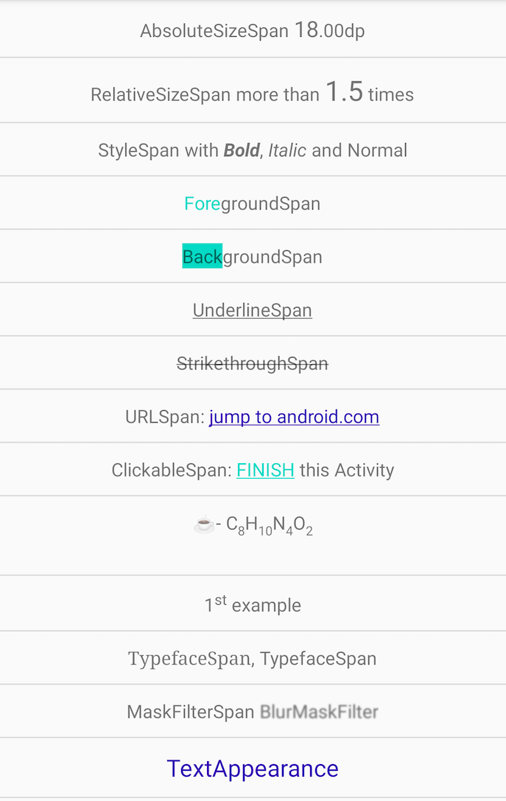

### Screenshot

### Features
- [x] BackGround
- [x] Foreground
- [x] Underline
- [x] StrikeThrough
- [x] Url
- [x] Suggestion
- [x] Superscript
- [X] Subscript
- [x] Italic
- [x] Bold
- [X] Typeface/font
- [X] Mask
- [x] Clickable
- [x] Text size
- [x] Custom appearance
- [x] Custom span
- [ ] Image

### Samples
see code

